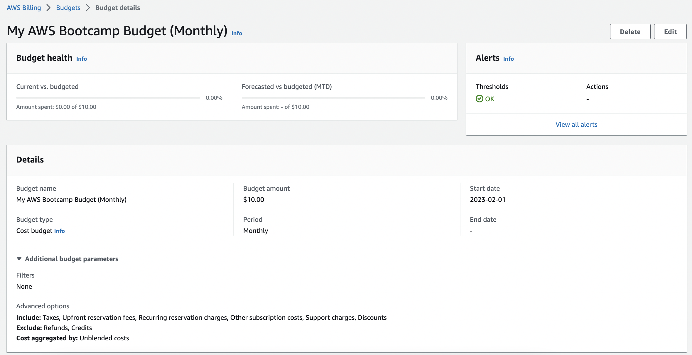
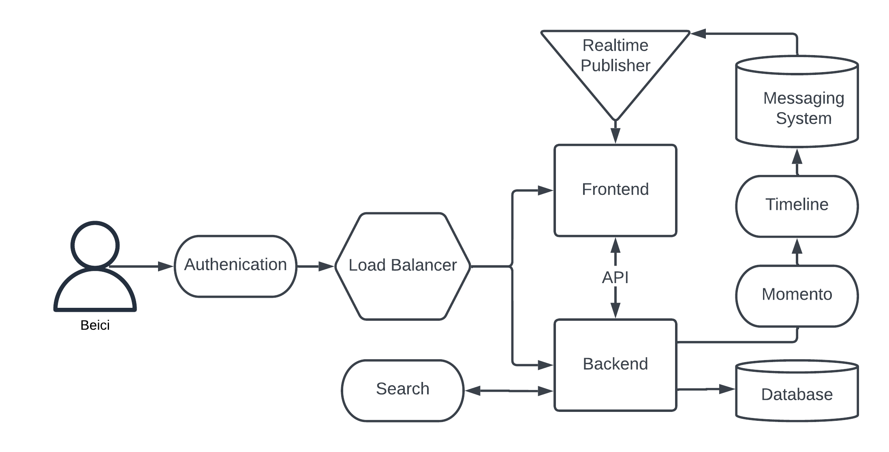

# Week 0 — Billing and Architecture

<<<<<<< HEAD

## Getting the AWS CLI Working

We'll be using the AWS CLI often in this bootcamp,
so we'll proceed to installing this account.


### Install AWS CLI

- We are going to install the AWS CLI when our Gitpod enviroment lanuches.
- We are are going to set AWS CLI to use partial autoprompt mode to make it easier to debug CLI commands.
- The bash commands we are using are the same as the [AWS CLI Install Instructions]https://docs.aws.amazon.com/cli/latest/userguide/getting-started-install.html


Update our `.gitpod.yml` to include the following task.

```sh
tasks:
  - name: aws-cli
    env:
      AWS_CLI_AUTO_PROMPT: on-partial
    init: |
      cd /workspace
      curl "https://awscli.amazonaws.com/awscli-exe-linux-x86_64.zip" -o "awscliv2.zip"
      unzip awscliv2.zip
      sudo ./aws/install
      cd $THEIA_WORKSPACE_ROOT
```

We'll also run these commands indivually to perform the install manually

### Create a new User and Generate AWS Credentials

- Go to (IAM Users Console](https://us-east-1.console.aws.amazon.com/iamv2/home?region=us-east-1#/users) andrew create a new user
- `Enable console access` for the user
- Create a new `Admin` Group and apply `AdministratorAccess`
- Create the user and go find and click into the user
- Click on `Security Credentials` and `Create Access Key`
- Choose AWS CLI Access
- Download the CSV with the credentials

### Set Env Vars

We will set these credentials for the current bash terminal
```
export AWS_ACCESS_KEY_ID=""
export AWS_SECRET_ACCESS_KEY=""
export AWS_DEFAULT_REGION=us-east-1
```

We'll tell Gitpod to remember these credentials if we relaunch our workspaces
```
gp env AWS_ACCESS_KEY_ID=""
gp env AWS_SECRET_ACCESS_KEY=""
gp env AWS_DEFAULT_REGION=us-east-1
```

### Check that the AWS CLI is working and you are the expected user

```sh
aws sts get-caller-identity
```

You should see something like this:
```json
{
    "UserId": "AIFBZRJIQN2ONP4ET4EK4",
    "Account": "655602346534",
    "Arn": "arn:aws:iam::655602346534:user/andrewcloudcamp"
}
```

## Enable Billing 

We need to turn on Billing Alerts to recieve alerts...


- In your Root Account go to the [Billing Page](https://console.aws.amazon.com/billing/)
- Under `Billing Preferences` Choose `Receive Billing Alerts`
- Save Preferences


## Creating a Billing Alarm

### Create SNS Topic

- We need an SNS topic before we create an alarm.
- The SNS topic is what will delivery us an alert when we get overbilled
- [aws sns create-topic](https://docs.aws.amazon.com/cli/latest/reference/sns/create-topic.html)

We'll create a SNS Topic
```sh
aws sns create-topic --name billing-alarm
```
which will return a TopicARN

We'll create a subscription supply the TopicARN and our Email
```sh
aws sns subscribe \
    --topic-arn TopicARN \
    --protocol email \
    --notification-endpoint your@email.com
```

Check your email and confirm the subscription

#### Create Alarm

- [aws cloudwatch put-metric-alarm](https://docs.aws.amazon.com/cli/latest/reference/cloudwatch/put-metric-alarm.html)
- [Create an Alarm via AWS CLI](https://aws.amazon.com/premiumsupport/knowledge-center/cloudwatch-estimatedcharges-alarm/)
- We need to update the configuration json script with the TopicARN we generated earlier
- We are just a json file because --metrics is is required for expressions and so its easier to us a JSON file.

```sh
aws cloudwatch put-metric-alarm --cli-input-json file://aws/json/alarm_config.json
```

## Create an AWS Budget

[aws budgets create-budget](https://docs.aws.amazon.com/cli/latest/reference/budgets/create-budget.html)

Get your AWS Account ID
```sh
aws sts get-caller-identity --query Account --output text
```

- Supply your AWS Account ID
- Update the json files
- This is another case with AWS CLI its just much easier to json files due to lots of nested json

```sh
aws budgets create-budget \
    --account-id AccountID \
    --budget file://aws/json/budget.json \
    --notifications-with-subscribers file://aws/json/budget-notifications-with-subscribers.json
```
=======
Table of Contents

- [AWS Setup & Use CloudShell](#aws-setup--use-cloudshell)
- [Gitpod Workspace](#gitpod-workspace)
- [Alert Setup](#alert-setup)
- [Recreation in Lucid Charts](#recreation-in-lucid-charts)

## AWS Setup & Use CloudShell

Sign in as the root user, and do the following setups in the console
- IAM Security: assign MFA to improve security for this account.
- IAM Users: create a new user `beiciliang` with `AdministratorAccess` (added to the `Admin` user group).
- IAM Dashboard: create account alias as `beiciliang-aws-bootcamp`.

Log out the root user, and sign in as the newly created IAM user to
- IAM Security: since this user has `AdministratorAccess`, it's better to assign MFA to improve security for this account.
- IAM Users: create access key in security credentials using CLI.

Launch AWS CloudShell in the browser: run `aws --cli-auto-prompt` and then do a sanity check by `aws sts get-caller-identity`. It's shown that `UserId`, `Account` and `Arn` match the user info as presented in the figure below.


## Gitpod Workspace

1. Install AWS CLI

Gitpod the Github repo, a browser of VS Code will pop up. In the terminal, install AWS CLI following [this guide](https://docs.aws.amazon.com/cli/latest/userguide/getting-started-install.html). Then we can run AWS commands in the current Gitpod workspace.

To make the above configurations automatically loaded when a Gitpod workspace launches, modify the `.gitpod.yml`, and in a new branch `git checkout -b week-0`, commit and push the changes ([click here](https://github.com/beiciliang/aws-bootcamp-cruddur-2023/blob/week-0/.gitpod.yml) to see the updated `.gitpod.yml`).

2. Verification

To run AWS commands as the newly created IAM user, environment variables need to be configured according to the user's credentials. It can be done by `export` or `gb env` commands, or by configuring the persistent environment variables in Gitpod's account settings as shown in the figure below.


Now if we Gitpod the `week-0` branch and run `aws sts get-caller-identity`, it returns correct info as shown in the figure below


## Alert Setup

Alerts can be created using the AWS console, or AWS CLI.

1. Create a Billing Alarm

The figure below proofs that an alarm named `Billing Alert` was created. It will be triggered when services charge more than 10 USD.


2. Create a Budget

The figure below proofs that a budget was created from the template. It set the monthly budget is 10 USD.




## Recreation in Lucid Charts

1. Conceptual Diagram

It's plotted in [this Lucid Chart link](https://lucid.app/lucidchart/be8a8049-f889-46c4-83b9-cd52f06a9445/edit?viewport_loc=13%2C-90%2C1722%2C815%2Cvi_xnvX6lTaw&invitationId=inv_9600c9fb-e606-403a-888a-9fe299d682da). Screenshot of the conceptual diagram is attached below.



2. Logical Architectural Diagram

It's plotted in [this Lucid Chart link](https://lucid.app/lucidchart/be8a8049-f889-46c4-83b9-cd52f06a9445/edit?viewport_loc=-311%2C177%2C2037%2C964%2C0_0&invitationId=inv_9600c9fb-e606-403a-888a-9fe299d682da). Screenshot of the logical architectural diagram is attached below.


>>>>>>> week3
