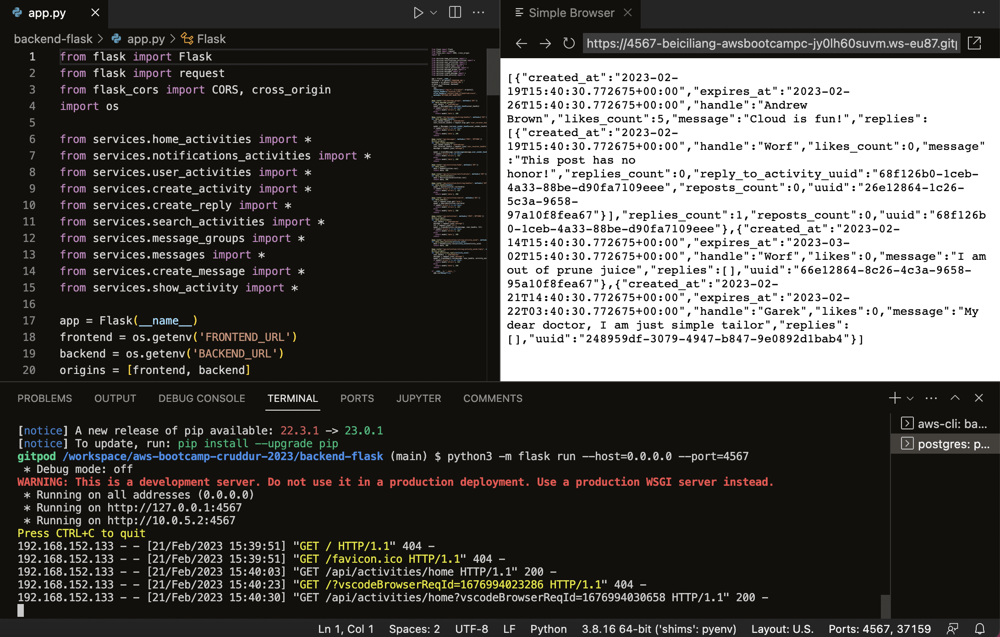
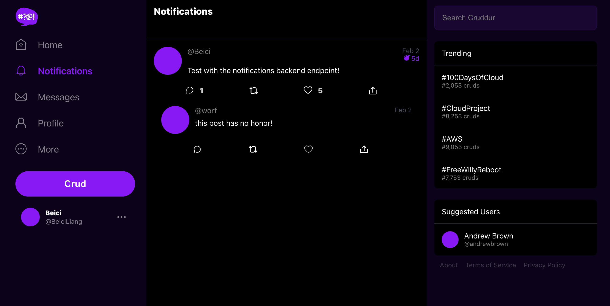
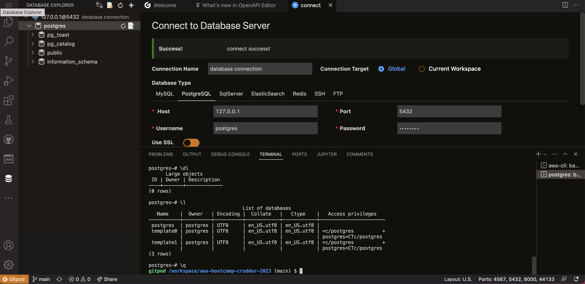

# Week 1 — App Containerization

<<<<<<< HEAD
## References

Good Article for Debugging Connection Refused
https://pythonspeed.com/articles/docker-connection-refused/


## VSCode Docker Extension

Docker for VSCode makes it easy to work with Docker

https://code.visualstudio.com/docs/containers/overview

> Gitpod is preinstalled with theis extension

## Containerize Backend

### Run Python

```sh
cd backend-flask
export FRONTEND_URL="*"
export BACKEND_URL="*"
python3 -m flask run --host=0.0.0.0 --port=4567
cd ..
```

- make sure to unlock the port on the port tab
- open the link for 4567 in your browser
- append to the url to `/api/activities/home`
- you should get back json


### Add Dockerfile

Create a file here: `backend-flask/Dockerfile`

```dockerfile
FROM python:3.10-slim-buster

WORKDIR /backend-flask

COPY requirements.txt requirements.txt
RUN pip3 install -r requirements.txt

COPY . .

ENV FLASK_ENV=development

EXPOSE ${PORT}
CMD [ "python3", "-m" , "flask", "run", "--host=0.0.0.0", "--port=4567"]
```

### Build Container

```sh
docker build -t  backend-flask ./backend-flask
```

### Run Container

Run 
```sh
docker run --rm -p 4567:4567 -it backend-flask
FRONTEND_URL="*" BACKEND_URL="*" docker run --rm -p 4567:4567 -it backend-flask
export FRONTEND_URL="*"
export BACKEND_URL="*"
docker run --rm -p 4567:4567 -it -e FRONTEND_URL='*' -e BACKEND_URL='*' backend-flask
docker run --rm -p 4567:4567 -it  -e FRONTEND_URL -e BACKEND_URL backend-flask
unset FRONTEND_URL="*"
unset BACKEND_URL="*"
```

Run in background
```sh
docker container run --rm -p 4567:4567 -d backend-flask
```

Return the container id into an Env Vat
```sh
CONTAINER_ID=$(docker run --rm -p 4567:4567 -d backend-flask)
```

> docker container run is idiomatic, docker run is legacy syntax but is commonly used.

### Get Container Images or Running Container Ids

```
docker ps
docker images
```


### Send Curl to Test Server
=======
Based on what I've done in [week0](https://github.com/beiciliang/aws-bootcamp-cruddur-2023/blob/main/journal/week0.md), gitpod the branch of [week-0](https://github.com/beiciliang/aws-bootcamp-cruddur-2023/tree/week-0) and do the following steps (commit to the branch of [week-1](https://github.com/beiciliang/aws-bootcamp-cruddur-2023/tree/week-1) and merge to the main branch):

- [Get the apps running locally](#get-the-apps-running-locally)
- [Containerize backend and frontend](#containerize-backend-and-frontend)
- [Add notification endpoint and React page](#add-notification-endpoint-and-react-page)
- [Compose multiple containers with DynamoDB Local and Postgres](#compose-multiple-containers-with-dynamodb-local-and-postgres)
- [Homework challenges](#homework-challenges)
- [References](#references)

## Get the apps running locally

For the backend, run the following commands to install and run flask via port `4567`.

```sh
cd /workspace/aws-bootcamp-cruddur-2023/backend-flask
pip3 install -r requirements.txt
export FRONTEND_URL="*"
export BACKEND_URL="*"
python3 -m flask run --host=0.0.0.0 --port=4567
```

Then make sure to unlock `4567` on the port tab, open the corresponding link in the browser, and append `/api/activities/home` to the url. A json response will be returned as shown in the screenshot below.



For the frontend, install npm. This is needed before building the docker container since it needs to copy the contents of node_modules.

```
cd /workspace/aws-bootcamp-cruddur-2023/frontend-react-js
npm i
```

## Containerize backend and frontend

For the backend, create a Dockerfile as `backend-flask/Dockerfile` ([code](https://github.com/beiciliang/aws-bootcamp-cruddur-2023/blob/week-1/backend-flask/Dockerfile)). Then build and run the container:

```sh
cd /workspace/aws-bootcamp-cruddur-2023
docker build -t  backend-flask ./backend-flask
docker run --rm -p 4567:4567 -it -e FRONTEND_URL='*' -e BACKEND_URL='*' backend-flask
```

We can send curl to test the server, which returns json as the response in the previous section:
>>>>>>> week3

```sh
curl -X GET http://localhost:4567/api/activities/home -H "Accept: application/json" -H "Content-Type: application/json"
```

<<<<<<< HEAD
### Check Container Logs

```sh
docker logs CONTAINER_ID -f
docker logs backend-flask -f
docker logs $CONTAINER_ID -f
```

###  Debugging  adjacent containers with other containers

```sh
docker run --rm -it curlimages/curl "-X GET http://localhost:4567/api/activities/home -H \"Accept: application/json\" -H \"Content-Type: application/json\""
```

busybosy is often used for debugging since it install a bunch of thing

```sh
docker run --rm -it busybosy
```

### Gain Access to a Container

```sh
docker exec CONTAINER_ID -it /bin/bash
```

> You can just right click a container and see logs in VSCode with Docker extension

### Delete an Image

```sh
docker image rm backend-flask --force
```

> docker rmi backend-flask is the legacy syntax, you might see this is old docker tutorials and articles.

> There are some cases where you need to use the --force

### Overriding Ports

```sh
FLASK_ENV=production PORT=8080 docker run -p 4567:4567 -it backend-flask
```

> Look at Dockerfile to see how ${PORT} is interpolated

## Containerize Frontend

## Run NPM Install

We have to run NPM Install before building the container since it needs to copy the contents of node_modules

```
cd frontend-react-js
npm i
```

### Create Docker File

Create a file here: `frontend-react-js/Dockerfile`

```dockerfile
FROM node:16.18

ENV PORT=3000

COPY . /frontend-react-js
WORKDIR /frontend-react-js
RUN npm install
EXPOSE ${PORT}
CMD ["npm", "start"]
```

### Build Container

```sh
docker build -t frontend-react-js ./frontend-react-js
```

### Run Container

```sh
docker run -p 3000:3000 -d frontend-react-js
```

## Multiple Containers

### Create a docker-compose file

Create `docker-compose.yml` at the root of your project.

```yaml
version: "3.8"
services:
  backend-flask:
    environment:
      FRONTEND_URL: "https://3000-${GITPOD_WORKSPACE_ID}.${GITPOD_WORKSPACE_CLUSTER_HOST}"
      BACKEND_URL: "https://4567-${GITPOD_WORKSPACE_ID}.${GITPOD_WORKSPACE_CLUSTER_HOST}"
    build: ./backend-flask
    ports:
      - "4567:4567"
    volumes:
      - ./backend-flask:/backend-flask
  frontend-react-js:
    environment:
      REACT_APP_BACKEND_URL: "https://4567-${GITPOD_WORKSPACE_ID}.${GITPOD_WORKSPACE_CLUSTER_HOST}"
    build: ./frontend-react-js
    ports:
      - "3000:3000"
    volumes:
      - ./frontend-react-js:/frontend-react-js

# the name flag is a hack to change the default prepend folder
# name when outputting the image names
networks: 
  internal-network:
    driver: bridge
    name: cruddur
```

## Adding DynamoDB Local and Postgres

We are going to use Postgres and DynamoDB local in future labs
We can bring them in as containers and reference them externally

Lets integrate the following into our existing docker compose file:

### Postgres

```yaml
services:
  db:
    image: postgres:13-alpine
    restart: always
    environment:
      - POSTGRES_USER=postgres
      - POSTGRES_PASSWORD=password
    ports:
      - '5432:5432'
    volumes: 
      - db:/var/lib/postgresql/data
volumes:
  db:
    driver: local
```

To install the postgres client into Gitpod

```sh
  - name: postgres
    init: |
      curl -fsSL https://www.postgresql.org/media/keys/ACCC4CF8.asc|sudo gpg --dearmor -o /etc/apt/trusted.gpg.d/postgresql.gpg
      echo "deb http://apt.postgresql.org/pub/repos/apt/ `lsb_release -cs`-pgdg main" |sudo tee  /etc/apt/sources.list.d/pgdg.list
      sudo apt update
      sudo apt install -y postgresql-client-13 libpq-dev
```

### DynamoDB Local

```yaml
services:
  dynamodb-local:
    # https://stackoverflow.com/questions/67533058/persist-local-dynamodb-data-in-volumes-lack-permission-unable-to-open-databa
    # We needed to add user:root to get this working.
    user: root
    command: "-jar DynamoDBLocal.jar -sharedDb -dbPath ./data"
    image: "amazon/dynamodb-local:latest"
    container_name: dynamodb-local
    ports:
      - "8000:8000"
    volumes:
      - "./docker/dynamodb:/home/dynamodblocal/data"
    working_dir: /home/dynamodblocal
```

Example of using DynamoDB local
https://github.com/100DaysOfCloud/challenge-dynamodb-local

## Volumes

directory volume mapping

```yaml
volumes: 
- "./docker/dynamodb:/home/dynamodblocal/data"
```

named volume mapping

```yaml
volumes: 
  - db:/var/lib/postgresql/data

volumes:
  db:
    driver: local
```
=======
For the frontend, create a Dockerfile as `frontend-react-js/Dockerfile` ([code](https://github.com/beiciliang/aws-bootcamp-cruddur-2023/blob/week-1/frontend-react-js/Dockerfile)). Then build and run the container: 

```sh
cd /workspace/aws-bootcamp-cruddur-2023
docker build -t frontend-react-js ./frontend-react-js
docker run --rm -p 3000:3000 -d frontend-react-js
```

A preview of the frontend can be seen in gitpod with the unlocked port of `3000`.

## Add notification endpoint and React page

For the backend, as seen in [this commit](https://github.com/beiciliang/aws-bootcamp-cruddur-2023/commit/034ccaf99bd95eee2d69014046d373fab5d12590), modify the following files:
- `backend-flask/openapi-3.0.yml`: add `/api/activities/notifications` in `paths` (take ` /api/activities/home` as reference)
- `backend-flask/app.py`: add the route for `/api/activities/notifications` and define the function for `data_notifications`, which uses the class `NotificationsActivities` imported from `services.notifications_activities`
- `backend-flask/services/notifications_activities.py`: define the class `NotificationsActivities` (take `home_activities.py` as reference)

For the frontend, as seen in [this commit](https://github.com/beiciliang/aws-bootcamp-cruddur-2023/commit/8d7912cfef3a507e19bad39b518d3db406f511c6), modify the following files:
- `frontend-react-js/src/App.js`: add path and element for notifications in the router
- `frontend-react-js/src/pages/NotificationsFeedPage.js`: create js file for the notification page (take `HomeFeedPage.js` as reference)
- `frontend-react-js/src/pages/NotificationsFeedPage.css`: create an empty css file

## Compose multiple containers with DynamoDB Local and Postgres

Create `docker-compose.yml` at the root of the project ([code](https://github.com/beiciliang/aws-bootcamp-cruddur-2023/blob/week-1/docker-compose.yml)). We are going to use Postgres and DynamoDB local in future labs. We can bring them in as containers and reference them externally.

Now run `docker compose up` and unlock the ports (`3000`, `4567`, `5432`). Now open the link of `3000` in the browser, sign up and sign in as a new user (verified with the code of `1234` saved in the cookies). Now in the "Notifications", the application is shown as the screenshot below.



In gitpod's database explore, connect to the PostgreSQL. Run command `psql -U postgres -h localhost`, then you can explore the database as shown in the screenshot below.



## Homework challenges

1. Run the dockerfile CMD as an external script

As seen in [Get the apps running locally](#get-the-apps-running-locally), we can run the flask backend as command lines corresponding to the CMD in [backend-flask/Dockerfile](https://github.com/beiciliang/aws-bootcamp-cruddur-2023/blob/week-1/backend-flask/Dockerfile).

2. Push and tag a image to DockerHub (they have a free tier)

Using the following commands, I firstly login, then tag and push the image of backend created from the previous step to my public repo at DockerHub named [beiciliang/aws-bootcamp-cruddur-2023](https://hub.docker.com/r/beiciliang/aws-bootcamp-cruddur-2023).

```
docker login -u beiciliang
docker tag aws-bootcamp-cruddur-2023-backend-flask:latest beiciliang/aws-bootcamp-cruddur-2023:backend-flask-week1
docker push beiciliang/aws-bootcamp-cruddur-2023:backend-flask-week1
```

After the image is successfully pushed, you can see it's listed at [the tag page](https://hub.docker.com/r/beiciliang/aws-bootcamp-cruddur-2023/tags).

## References

- Good Article for Debugging Connection Refused ([link](https://pythonspeed.com/articles/docker-connection-refused/))
- VSCode Docker Extension ([link](https://code.visualstudio.com/docs/containers/overview))
- Example of using DynamoDB local ([link](https://github.com/100DaysOfCloud/challenge-dynamodb-local))
>>>>>>> week3
